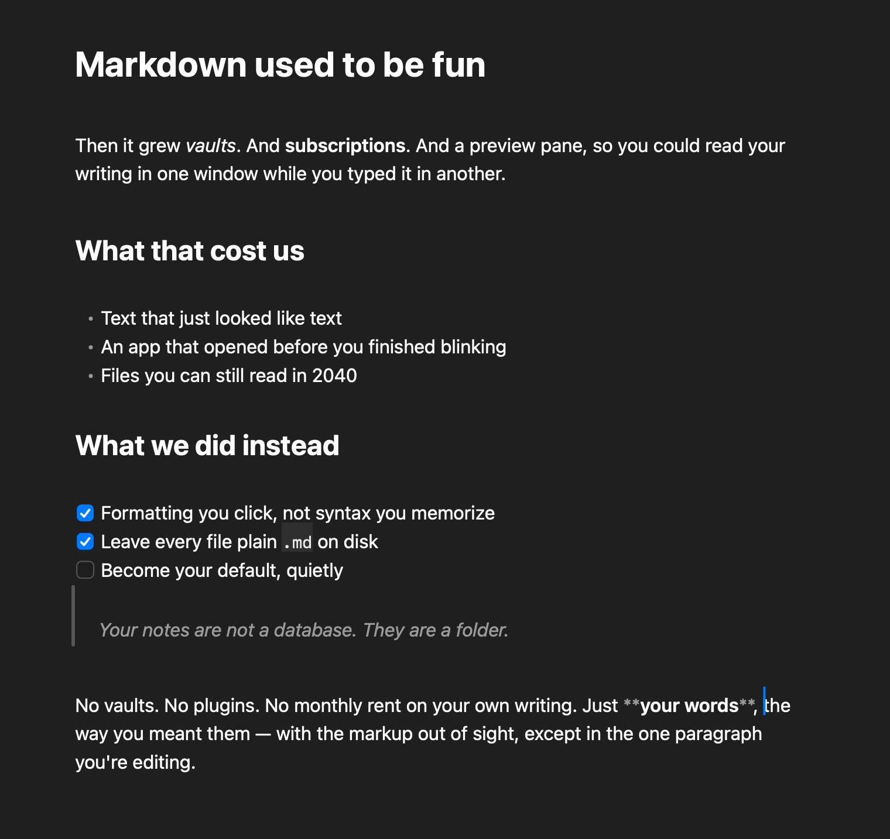

# Vireo

Vireo is a fast, native markdown editor for macOS. It renders markdown as
clean formatted text and hides the syntax, even while you type. No vaults,
no plugins, no subscription. Your files stay on your Mac.

[Download the latest release](https://github.com/rauschermate/vireo/releases/latest/download/Vireo.dmg)
or visit [vireo.md](https://vireo.md). Vireo needs macOS 15 or later.



## How it works

The block that holds the caret shows its raw syntax, dimmed. Every other block
stays clean. When the caret moves away, the block hides its syntax again. The
caret walks real characters, so backspace deletes the character you see.

The markdown source string is the only source of truth. The text view holds the
raw markdown. Hidden markers stay in the text store as zero-width glyphs. A save
writes the string back to disk unchanged.

## Features

- Headings, bold, italic, strikethrough, inline code, links, block quotes,
  nested lists, task checkboxes, fenced code with syntax colors, and images.
- GFM tables render as a grid. A click on a cell opens a native cell editor.
  Tab moves between cells. A cell menu adds rows and columns.
- List editing: Enter continues a list and renumbers the items below. Tab and
  Shift-Tab indent and outdent.
- A floating format toolbar on selection, plus ⌘B, ⌘I, ⌘K, and a Format menu.
- Tabs with inline rename, a workspace sidebar with pinned files, recents, and
  a folder tree, ⌘P quick open, a table of contents sidebar, focus mode, and
  find in the document.
- Auto-save by default, or an explicit ⌘S mode. External changes reload, with
  a prompt on conflict.
- A Quick Look extension that previews `.md` files in Finder with the same
  render pipeline.
- Background updates through Sparkle. A small pill in the window corner
  announces a new version. One click installs it and relaunches.
- Light and dark mode, a sans or mono document font, and proportional zoom.

## Build from source

You need macOS 15 or later, Xcode 26, and Swift 6. The app bundle also needs
[XcodeGen](https://github.com/yonaskolb/XcodeGen).

```bash
brew install xcodegen

swift test                                   # parser, editor, and updater tests
./scripts/build-app-xcode.sh Debug           # app + Quick Look extension
open -a "$PWD/build/Vireo.app" samples/welcome.md
```

`open -a` needs an absolute path. Do not pass files after `--args`, because
that launches the app without a window.

Other useful commands:

```bash
./scripts/install.sh                         # copy to /Applications, set as default .md app
./scripts/build-app.sh                       # quick bundle without the Quick Look extension
swift run VireoSnapshot samples/welcome.md out.png          # headless render to PNG
swift run VireoSnapshot samples/welcome.md out.png --dark
swift run -c release VireoSnapshot big.md --bench           # profile the pipeline
swift run VireoUpdaterSnapshot pill.png                     # preview the update pill
```

`VireoSnapshot` runs the real TextKit pipeline without a window. It is the
fastest way to check a render change.

Every pull request runs the tests, builds the app and extension, and renders
light and dark snapshots on GitHub Actions.

## Architecture

Vireo is a set of local Swift packages, consumed by a SwiftUI app target.

| Package | Responsibility |
|---|---|
| `MarkdownEngine` | Parse GFM with swift-markdown into marker and style ranges over the untouched source |
| `MarkdownRender` | Turn ranges into a styled `NSAttributedString`. The custom `NSLayoutManager` hides syntax and draws bullets, checkboxes, and images |
| `MarkdownEditor` | The `NSTextView` (TextKit 1) in a SwiftUI wrapper. Formatting, links, the floating toolbar |
| `VireoCore` | Atomic file I/O, the file watcher, preferences |
| `VireoUpdater` | The Sparkle wrapper and its update state machine |
| `VireoUpdaterUI` | The update pill |
| `Vireo` | The app: tabs, sidebars, table of contents, menus, zoom, auto-save |

Two decisions carry the design:

- **TextKit 1, not TextKit 2.** To hide syntax, the layout manager emits null
  glyphs for marker ranges. TextKit 2 does not expose that control.
- **Incremental parsing.** Each edit re-parses only the enclosing block and
  splices the result. The incremental output must equal a full re-parse. Tests
  enforce this with scenarios and fuzzing. A keystroke costs about 16 ms on a
  1.4 MB document.

Read [`docs/eng-design.md`](docs/eng-design.md) for the full design. Section 14
lists where the shipped app differs from the plan. Read
[`docs/prd.md`](docs/prd.md) for the product vision.

## Releases

`scripts/release.sh` cuts a signed, notarized release with a working update
feed. Its header lists the Developer ID variables it needs. The steps:

1. Bump the version in `project.yml`.
2. Run `./scripts/release.sh --publish`.

The script archives the app, notarizes the app and the disk image, signs the
update, and publishes a GitHub release with the appcast. Run
`./scripts/updater-keys.sh` once per release machine to create the Sparkle key.

## Known gaps

- Caret movement across blocks other than the caret's block still snaps over
  hidden markers. Home, End, and Option-arrow keep small gaps.
- No Quick Look thumbnail extension yet.
- The Quick Look preview cannot load local images next to the file. The
  sandbox grants access to the previewed file only.

## Contribute

Open an issue before a large change. Run `swift test` before you push. If you
touch the parser, keep the incremental result identical to a full re-parse.

## Third-party software

- [swift-markdown](https://github.com/apple/swift-markdown) and
  [swift-cmark](https://github.com/apple/swift-cmark), Apache 2.0 and BSD.
- [Sparkle](https://github.com/sparkle-project/Sparkle), MIT.

## License

Vireo is released under the MIT License. See [LICENSE](LICENSE).
